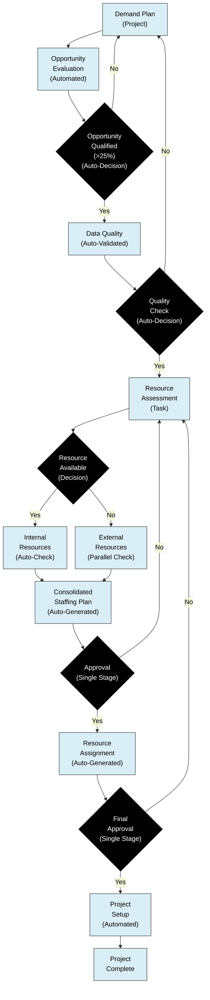

# Flowchart Graph Analysis

## Swimlanes and Color Legend
1. TA: Light Blue (#d9eaf7)
2. Subcontractors: Light Purple (#e6d8ea)
3. IBM WFM: Light Lavender (#e6d8f7)
4. CIO/RF: Light Cyan (#d9f7ea)
5. Decision/Approval: Light Pink (#f7d9ea)
6. WFM: Light Green (#d8eae6)
7. Demand Lead: Light Yellow (#eae6d8)
8. Default: White (#ffffff)
## Swimlanes and Color Legend
1. TA: Light Blue (#d9eaf7)
2. Subcontractors: Light Purple (#e6d8ea)
3. IBM WFM: Light Lavender (#e6d8f7)
4. CIO/RF: Light Cyan (#d9f7ea)
5. Decision/Approval: Light Pink (#f7d9ea)
6. WFM: Light Green (#d8eae6)
7. Demand Lead: Light Yellow (#eae6d8)
8. Default: White (#ffffff)

## Mermaid Flowchart

```mermaid
%%{init: {
  'theme': 'base',
  'themeVariables': { 
    'background': 'transparent',
    'primaryColor': '#d8eae6',
    'primaryTextColor': 'black',
    'primaryBorderColor': '#333',
    'lineColor': '#333'
  },
  'flowchart': {
    'nodeSpacing': 20,
    'rankSpacing': 30,
    'curve': 'basis'
  }
}}%%

flowchart TB
    %% Style Definitions
    classDef defaultStyle fill:white,stroke:#333,stroke-width:1px;
    classDef startStyle fill:#d8eae6,stroke:#333,stroke-width:1px,color:black;
    classDef endStyle fill:#f7d9ea,stroke:#333,stroke-width:1px,color:black;
    classDef stateStyle fill:#d8eae6,stroke:#333,stroke-width:1px,color:black;
    classDef decisionStyle fill:black,stroke:#333,stroke-width:1px,color:white;
    classDef demandLeadStyle fill:#eae6d8,stroke:#333,stroke-width:1px,color:black;
    classDef wfmStyle fill:#d8eae6,stroke:#333,stroke-width:1px,color:black;
    classDef approvalStyle fill:#f7d9ea,stroke:#333,stroke-width:1px,color:black;
    classDef cioStyle fill:#d9f7ea,stroke:#333,stroke-width:1px,color:black;
    classDef ibmStyle fill:#e6d8f7,stroke:#333,stroke-width:1px,color:black;
    classDef subStyle fill:#e6d8ea,stroke:#333,stroke-width:1px,color:black;
    classDef taStyle fill:#d9eaf7,stroke:#333,stroke-width:1px,color:black;

    %% Initial Process Nodes
    n1["Demand Plan<br/>(Project)"]
    n2["Opportunity<br/>Evaluation<br/>(Project Task)"]
    n3{"Opportunity<br/>Qualified<br/>(>25%)<br/>(Decision)"}
    n4["Data Quality<br/>Check<br/>(Task)"]
    n5{"Quality<br/>confirmed<br/>(Decision)"}
    n50["Role<br/>Clarification<br/>(Task)"]
    n501["RR update<br/>(Task)"]
    n51["Internal Check<br/>(Task)"]
    nA["WFM Strategy<br/>(Reference)"]
    nB["Opportunity<br/>'ClosingStage'"]

    %% Expert Finding Nodes
    n52{"Experts<br/>Found<br/>(Decision)"}
    n520["Experts<br/>Proposed<br/>(Task)"]
    n521["Gap Analysis<br/>(Task)"]
    n522["Staffing<br/>Recommendations<br/>(Task)"]
    n523{"Recommendation<br/>Acceptance<br/>(Approval)"}
    n5230{"Internal<br/>Experts<br/>(Decision)"}
    n5231["Inform TA<br/>(Notification)"]
    n5232{"WFM Approval<br/>(Approval)"}
    n52320["Job<br/>Description<br/>(Document)"]
    n52321["CIO/RF<br/>Review<br/>(Task)"]
    n52322{"Approved<br/>(Approval)"}

    %% Final Process Nodes
    n52323["Internal<br/>Promotion<br/>(Task)"]
    n52324["TA Process<br/>(Task)"]
    n523220["Experts<br/>Softbooked<br/>(Resources)"]
    n523221["External<br/>WFM<br/>(Task)"]
    n523222{"Approved<br/>(Approval)"}
    n5232220["Subcontractors<br/>(Resources)"]
    n523223["Assignment<br/>(Resource<br/>Assignment)"]
    n52322210["Hiring<br/>Approval<br/>(Approval)"]
    n5232221{"Final<br/>Approval<br/>(Approval)"}
    stop["Project<br/>Complete"]

    %% Initial Flow Connections
    n1 --> n2
    n2 --> n3
    n3 -->|No| n1
    n3 -->|Yes| n4
    n4 --> n5
    n5 -->|No| n50
    n50 --> n501
    n501 --> n4
    n5 -->|Yes| n51
    nA -.-> n51

    %% Expert Finding Flow
    n51 --> n52
    n52 -->|Yes| n520
    n52 -->|No| n521
    n520 --> n522
    n521 --> n522
    n522 --> n523
    n523 -->|No| n51

    %% Approval Chain
    n523 -->|Yes| n5230
    n5230 -->|No| n5231
    n5231 --> n5232
    n5232 -->|Yes| n5230
    n5230 -->|Yes| n52320
    n52320 --> n52321
    n52321 --> n52322

    %% Final Paths
    n52320 --> n52323
    n52323 --> n52324
    n52324 --> n523220
    n523220 --> n523223
    n523223 --> stop
    n52322 -->|Yes| n523220
    n52322 -->|No| n523221
    n523221 --> n523222
    n523222 -->|Yes| n523220
    n523222 -->|No| n5232220
    n5232220 --> n5232221
    n5232221 -->|Yes| n523220
    n5232221 -->|No| n52322210
    n52322210 --> n52324
    nB -.-> n523223

    %% Apply Styles
    class n1,n50,n501 demandLeadStyle;
    class n2,n4,n51,n520,n521,n522,n5231,n52320,n523223 wfmStyle;
    class n52321 cioStyle;
    class n52323,n52324 taStyle;
    class n523220,n5232220 subStyle;
    class n523221 ibmStyle;
    class n3,n5,n52,n523,n5230,n5232,n52322,n523222,n5232221 decisionStyle;
    class n52322210 approvalStyle;
    class stop endStyle;
    class nA,nB defaultStyle;
```



## Node Details

```yaml
Node ID: 1
Text: Demand Plan
Swimlane: Demand Lead
Type: start
Input Branches: []
Output Branches: [(501, "")]
```

```yaml
Node ID: 2
Text: Opportunity Evaluation
Swimlane: WFM
Type: start
Input Branches: []
Output Branches: [(3, "")]
```

```yaml
Node ID: 3
Text: Opportunity Qualified (>25%)
Swimlane: WFM
Type: decision
Input Branches: [(2, "")]
Output Branches: [(4, "Yes"), (1, "No")]
```

```yaml
Node ID: 4
Text: Mandatory & descriptive data quality check
Swimlane: WFM
Type: state
Input Branches: [(3, "Yes"), (50, "")]
Output Branches: [(5, "")]
```

```yaml
Node ID: 5
Text: Quality confirmed
Swimlane: WFM
Type: decision
Input Branches: [(4, "")]
Output Branches: [(51, "Yes"), (50, "No")]
```

```yaml
Node ID: 50
Text: RR Role Clarification (email/slack)
Swimlane: Demand Lead
Type: state
Input Branches: [(501, ""), (5, "No")]
Output Branches: [(4, "")]
```

```yaml
Node ID: 501
Text: RR update
Swimlane: Demand Lead
Type: state
Input Branches: [(1, "")]
Output Branches: [(50, "")]
```

```yaml
Node ID: 51
Text: Internal Check
Swimlane: WFM
Type: state
Input Branches: [(5, "Yes"), (A, "dotted")]
Output Branches: [(52, "")]
```

```yaml
Node ID: 52
Text: Expert(s) Found
Swimlane: WFM
Type: decision
Input Branches: [(51, "")]
Output Branches: [(520, "Yes"), (521, "No")]
```

```yaml
Node ID: 520
Text: Expert(s) Proposed
Swimlane: WFM
Type: state
Input Branches: [(52, "Yes")]
Output Branches: [(522, "")]
```

```yaml
Node ID: 521
Text: Gap Analysis
Swimlane: WFM
Type: state
Input Branches: [(52, "No")]
Output Branches: [(522, "")]
```

```yaml
Node ID: 522
Text: Staffing Recommendations
Swimlane: WFM
Type: state
Input Branches: [(520, ""), (521, "")]
Output Branches: [(523, "")]
```

```yaml
Node ID: 523
Text: Staffing Recommendation Acceptance
Swimlane: Decision/Approval
Type: decision
Input Branches: [(522, "")]
Output Branches: [(5230, "Yes"), (51, "No")]
```

```yaml
Node ID: 5230
Text: Internal Expert(s)
Swimlane: Decision/Approval
Type: decision
Input Branches: [(523, "Yes"), (5232, "Yes")]
Output Branches: [(5231, "No"), (52320, "Yes")]
```

```yaml
Node ID: 5231
Text: Inform TA
Swimlane: WFM
Type: state
Input Branches: [(5230, "No")]
Output Branches: [(5232, "")]
```

```yaml
Node ID: 5232
Text: Global Head of WFM approval
Swimlane: Decision/Approval
Type: decision
Input Branches: [(5231, "")]
Output Branches: [(5230, "Yes"), (5231, "No")]
```

```yaml
Node ID: 52320
Text: Job description
Swimlane: WFM
Type: state
Input Branches: [(5230, "Yes")]
Output Branches: [(52321, ""), (52323, "")]
```

```yaml
Node ID: 52321
Text: CIO/RF
Swimlane: CIO/RF
Type: state
Input Branches: [(52320, "")]
Output Branches: [(52322, "")]
```

```yaml
Node ID: 52322
Text: Approved
Swimlane: Decision/Approval
Type: decision
Input Branches: [(52321, "")]
Output Branches: [(523220, "Yes"), (523221, "No")]
```

```yaml
Node ID: 52323
Text: Internal promotion
Swimlane: TA
Type: state
Input Branches: [(52320, "")]
Output Branches: [(52324, "")]
```

```yaml
Node ID: 52324
Text: TA
Swimlane: TA
Type: state
Input Branches: [(52323, ""), (52322210, "")]
Output Branches: [(523220, "")]
```

```yaml
Node ID: 523220
Text: Experts Softbooked
Swimlane: Subcontractors
Type: state
Input Branches: [(52324, ""), (52322, "Yes"), (523222, "Yes"), (5232221, "Yes")]
Output Branches: [(523223, "")]
```

```yaml
Node ID: 523221
Text: IBM WFM
Swimlane: IBM WFM
Type: state
Input Branches: [(52322, "No")]
Output Branches: [(523222, "")]
```

```yaml
Node ID: 523222
Text: Approved
Swimlane: Decision/Approval
Type: decision
Input Branches: [(523221, "")]
Output Branches: [(523220, "Yes"), (52322210, "No")]
```

```yaml
Node ID: 523223
Text: Assignment
Swimlane: WFM
Type: end_state
Input Branches: [(523220, ""), (B, "dotted")]
Output Branches: [(stop, "")]
```

```yaml
Node ID: 52322210
Text: NC hiring approval flow
Swimlane: Decision/Approval
Type: state
Input Branches: [(523222, "No"), (5232221, "No")]
Output Branches: [(52324, "")]
```

```yaml
Node ID: 5232221
Text: Approved
Swimlane: Decision/Approval
Type: decision
Input Branches: []
Output Branches: [(523220, "Yes"), (52322210, "No")]
```

```yaml
Node ID: 5232220
Text: Subcontractors
Swimlane: Subcontractors
Type: state
Input Branches: [(523222, "No")]
Output Branches: [(5232221, "")]
```

```yaml
Node ID: A
Text: NC WFM Strategy
Swimlane: Default
Type: state
Input Branches: []
Output Branches: [(51, "dotted")]
```

```yaml
Node ID: B
Text: Opportunity Closing Stage
Swimlane: Default
Type: state
Input Branches: []
Output Branches: [(523223, "dotted")]
```

```yaml
Node ID: stop
Text: ""
Swimlane: Default
Type: end_state
Input Branches: [(523223, "")]
Output Branches: []
```

## Certinia Implementation

### Normal Implementation

This implementation follows the current workflow structure while utilizing Certinia's features to automate and track the process.

#### Key Certinia Components Used:
- **Projects** - For tracking opportunity evaluations
- **Billing Accounts** - For resource planning
- **Milestones** - For tracking key approvals
- **Tasks** - For tracking activities within each stage
- **Approvals** - For multi-stage approval processes
- **Resources** - For managing and assigning experts
- **Timesheets** - For tracking time spent on activities

```mermaid
%%{init: {
  'theme': 'base',
  'themeVariables': { 
    'background': 'transparent',
    'primaryColor': '#d9eef7',
    'primaryTextColor': 'black',
    'primaryBorderColor': '#333',
    'lineColor': '#333'
  },
  'flowchart': {
    'nodeSpacing': 20,
    'rankSpacing': 30,
    'curve': 'basis'
  }
}}%%

flowchart TB
    %% Style Definitions
    classDef defaultStyle fill:#d9eef7,stroke:#333,stroke-width:1px,color:black;
    classDef decisionStyle fill:black,stroke:#333,stroke-width:1px,color:white;
    classDef endStyle fill:#d9eef7,stroke:#333,stroke-width:1px,color:black;

    %% Initial Process Nodes
    n1["Demand Plan<br/>(Project)"]
    n2["Opportunity<br/>Evaluation<br/>(Project Task)"]
    n3{"Opportunity<br/>Qualified<br/>(>25%)<br/>(Decision)"}
    n4["Data Quality<br/>Check<br/>(Task)"]
    n5{"Quality<br/>confirmed<br/>(Decision)"}
    n50["Role<br/>Clarification<br/>(Task)"]
    n501["RR update<br/>(Task)"]
    n51["Internal Check<br/>(Task)"]
    nA["WFM Strategy<br/>(Reference)"]

    %% Expert Finding Nodes
    n52{"Experts<br/>Found<br/>(Decision)"}
    n520["Experts<br/>Proposed<br/>(Task)"]
    n521["Gap Analysis<br/>(Task)"]
    n522["Staffing<br/>Recommendations<br/>(Task)"]
    n523{"Recommendation<br/>Acceptance<br/>(Approval)"}
    n5230{"Internal<br/>Experts<br/>(Decision)"}
    n5231["Inform TA<br/>(Notification)"]
    n5232{"WFM Approval<br/>(Approval)"}
    n52320["Job<br/>Description<br/>(Document)"]
    n52321["CIO/RF<br/>Review<br/>(Task)"]
    n52322{"Approved<br/>(Approval)"}

    %% Final Process Nodes
    n52323["Internal<br/>Promotion<br/>(Task)"]
    n52324["TA Process<br/>(Task)"]
    n523220["Experts<br/>Softbooked<br/>(Resources)"]
    n523221["External<br/>WFM<br/>(Task)"]
    n523222{"Approved<br/>(Approval)"}
    n5232220["Subcontractors<br/>(Resources)"]
    n523223["Assignment<br/>(Resource<br/>Assignment)"]
    n52322210["Hiring<br/>Approval<br/>(Approval)"]
    n5232221{"Final<br/>Approval<br/>(Approval)"}
    stop["Project<br/>Complete"]

    %% Initial Flow Connections
    n1 --> n2
    n2 --> n3
    n3 -->|No| n1
    n3 -->|Yes| n4
    n4 --> n5
    n5 -->|No| n50
    n50 --> n501
    n501 --> n4
    n5 -->|Yes| n51
    nA -.-> n51

    %% Expert Finding Flow
    n51 --> n52
    n52 -->|Yes| n520
    n52 -->|No| n521
    n520 --> n522
    n521 --> n522
    n522 --> n523
    n523 -->|No| n51

    %% Approval Chain
    n523 -->|Yes| n5230
    n5230 -->|No| n5231
    n5231 --> n5232
    n5232 -->|Yes| n5230
    n5230 -->|Yes| n52320
    n52320 --> n52321
    n52321 --> n52322

    %% Final Paths
    n52320 --> n52323
    n52323 --> n52324
    n52324 --> n523220
    n523220 --> n523223
    n523223 --> stop
    n52322 -->|Yes| n523220
    n52322 -->|No| n523221
    n523221 --> n523222
    n523222 -->|Yes| n523220
    n523222 -->|No| n5232220
    n5232220 --> n5232221
    n5232221 -->|Yes| n523220
    n5232221 -->|No| n52322210
    n52322210 --> n52324
    nB -.-> n523223

    %% Apply Styles
    class n1,n2,n4,n50,n501,n51,n520,n521,n522,n5231,n52320,n52323,n52324,n523220,n523221,n523223,n52322210,nA,stop defaultStyle;
    class n3,n5,n52,n523,n5230,n5232,n52322,n523222,n5232221 decisionStyle;
    class n52321 defaultStyle;
    class n5232220 defaultStyle;
```



### Optimized Implementation

This optimized implementation streamlines the workflow by:
- Reducing approval stages
- Automating notifications and updates
- Implementing parallel processes where possible
- Using predefined templates and checklists

#### Key Optimizations:
- Automated data quality validation
- Streamlined approval flows
- Parallel processing of internal and external resource checks
- Predefined resource pools for faster staffing
- Direct integration with talent management systems

