# Optimized Certinia Implementation

This optimized implementation streamlines the workflow by:
- Reducing approval stages
- Automating notifications and updates
- Implementing parallel processes where possible
- Using predefined templates and checklists

## Key Optimizations:
- Automated data quality validation
- Streamlined approval flows
- Parallel processing of internal and external resource checks
- Predefined resource pools for faster staffing
- Direct integration with talent management systems

## Understanding the Optimized Process

The optimized Certinia workflow simplifies resource management through automation and streamlined approvals. Here's how it works in practice:

1. **From Demand to Opportunity**
   - Everything starts with the Demand Plan in Certinia, which kicks off automated opportunity evaluation.
   - The system evaluates each opportunity against your predefined criteria (those with >25% probability move forward).
   - Opportunities that don't meet the threshold return to planning for refinement.

2. **Smart Quality Checks**
   - Qualified opportunities automatically go through Certinia's quality validation.
   - The system ensures all necessary information is complete and accurate.
   - If something's missing, the opportunity returns to planning with clear notifications about what needs fixing.

3. **Finding the Right Resources**
   - Once quality is confirmed, resource assessment begins.
   - Certinia intelligently branches the search in two directions simultaneously:
     * Internal talent matching: Automatically scans your available internal resources
     * External resource evaluation: Checks suitable external options at the same time

4. **Simplified Staffing Decisions**
   - Both resource searches feed into a comprehensive staffing plan that Certinia generates automatically.
   - A single approval step replaces the previous multi-stage approval chain, cutting bureaucracy.
   - If the plan needs adjustments, it simply returns to the resource assessment phase.

5. **Getting to Work**
   - After approval, Certinia automatically handles resource assignment.
   - The system also manages subcontractor resources through an automated assignment process.
   - A final, streamlined approval confirms everything is ready.
   - The system then automatically configures the project.
   - Your team can start working immediately once the project is complete.

This approach transforms your workflow by reducing steps from over 20 to just 14. The improvements focus on:
- Replacing manual reviews with smart validation
- Simplifying multiple approvals into clear decision points
- Searching for internal and external resources simultaneously
- Automating project setup and resource assignment

The result? Significantly faster project initiation while maintaining proper governance and quality control.

```mermaid
%%{init: {
  'theme': 'base',
  'themeVariables': { 
    'background': 'transparent',
    'primaryColor': '#d9eef7',
    'primaryTextColor': 'black',
    'primaryBorderColor': '#333',
    'lineColor': '#333'
  },
  'flowchart': {
    'nodeSpacing': 20,
    'rankSpacing': 30,
    'curve': 'basis'
  }
}}%%

flowchart TB
    %% Style Definitions
    classDef defaultStyle fill:#d9eef7,stroke:#333,stroke-width:1px,color:black;
    classDef decisionStyle fill:black,stroke:#333,stroke-width:1px,color:white;
    classDef endStyle fill:#d9eef7,stroke:#333,stroke-width:1px,color:black;

    %% Initial Process Nodes
    n1["Demand Plan<br/>(Project)"]
    n2["Opportunity<br/>Evaluation<br/>(Automated)"]
    n3{"Opportunity<br/>Qualified<br/>(>25%)<br/>(Auto-Decision)"}
    n4["Data Quality<br/>(Auto-Validated)"]
    n5{"Quality<br/>Check<br/>(Auto-Decision)"}
    n51["Resource<br/>Assessment<br/>(Task)"]

    %% Expert Finding Nodes - Streamlined
    n52{"Resource<br/>Available<br/>(Decision)"}
    n520["Internal<br/>Resources<br/>(Auto-Check)"]
    n521["External<br/>Resources<br/>(Parallel Check)"]
    n522["Consolidated<br/>Staffing Plan<br/>(Auto-Generated)"]
    n523{"Approval<br/>(Single Stage)"}

    %% Final Process - Simplified
    n5230["Resource<br/>Assignment<br/>(Auto-Generated)"]
    n5232220["Subcontractors<br/>(Auto-Assigned)"]
    n5231{"Final<br/>Approval<br/>(Single Stage)"}
    n5232["Project<br/>Setup<br/>(Automated)"]
    stop["Project<br/>Complete"]

    %% Streamlined Flow
    n1 --> n2
    n2 --> n3
    n3 -->|No| n1
    n3 -->|Yes| n4
    n4 --> n5
    n5 -->|No| n1
    n5 -->|Yes| n51
    
    %% Parallel Resource Assessment
    n51 --> n52
    n52 -->|Yes| n520
    n52 -->|No| n521
    n520 --> n522
    n521 --> n522
    n522 --> n523
    
    %% Simplified Approval and Assignment
    n523 -->|Yes| n5230
    n523 -->|No| n51
    n5230 --> n5232220
    n5232220 --> n5231
    n5231 -->|Yes| n5232
    n5231 -->|No| n51
    n5232 --> stop

    %% Apply Styles
    class n1,n2,n4,n51,n520,n521,n522,n5230,n5232220,n5232,stop defaultStyle;
    class n3,n5,n52,n523,n5231 decisionStyle;
```

## Walking Through the Optimized Workflow

Let's explore how this workflow actually operates in Certinia, from initial demand to project completion:

### Starting the Journey: Demand to Quality

**Demand Plan (Project)** is where everything begins. This is your project container in Certinia that houses all related activities. When a new opportunity appears, it automatically triggers the **Opportunity Evaluation (Automated)** process without manual intervention. 

The system then reaches our first decision point: **"Is this opportunity qualified?"** Certinia evaluates the opportunity against predefined probability thresholds (those above 25% probability continue forward). What's powerful here is this qualification happens automatically using data already in your system—no manual scoring or subjective evaluation required.

If an opportunity doesn't meet qualification criteria, it loops back to the Demand Plan for further nurturing or refinement. For qualified opportunities, they move to **Data Quality (Auto-Validated)**, where Certinia's validation rules verify all required fields are properly populated.

The **Quality Check (Auto-Decision)** determines if the data meets your organization's standards. Unlike the traditional approach where team members manually review entries, Certinia's automated validation identifies issues instantly and provides clear directives on what needs correction. When quality checks fail, the opportunity returns to the Demand Plan with specific notifications about what's missing.

### Finding and Securing Resources

Once quality is confirmed, the **Resource Assessment (Task)** begins. This stage involves determining what resources are needed and their availability. The key enhancement here is that resource assessment is now a structured task with defined inputs and outputs in Certinia.

At the **"Resource Available?"** decision point, Certinia branches the process in two directions simultaneously—something impossible in a traditional workflow:

1. When resources are available, the **Internal Resources (Auto-Check)** automatically scans your internal talent pool to find matches based on skills, availability, and location.

2. If internal resources aren't immediately identified, **External Resources (Parallel Check)** evaluates subcontractor and partner availability at the same time—not as a fallback after internal options are exhausted.

Both paths converge at the **Consolidated Staffing Plan (Auto-Generated)**, where Certinia combines findings into a comprehensive resource proposal. This consolidation happens automatically, replacing manual compilation of different resource options.

The staffing plan moves to **Approval (Single Stage)**—a single checkpoint that replaces the multi-stage approval chain in the traditional workflow. This consolidation alone can save days or even weeks of waiting time. If not approved, the system returns to Resource Assessment with feedback intact, maintaining the context of the decision.

### Finalizing and Launching the Project

Upon approval, **Resource Assignment (Auto-Generated)** is created by Certinia, automatically allocating resources to specific project tasks. The system then handles **Subcontractors (Auto-Assigned)** through an integrated process, generating appropriate assignment documentation and notifications.

Next comes the **Final Approval (Single Stage)**, confirming all resources (both internal and external) are properly allocated. What's notable is that this approval focuses specifically on resource assignment validity, not revisiting the earlier business case or staffing plan decisions.

After final approval, **Project Setup (Automated)** kicks in, where Certinia automatically configures the complete project structure—creating tasks, establishing dependencies, setting milestones, and building reporting structures. Finally, the workflow concludes with **Project Complete**, where your team can begin executing the work.

### Key Workflow Insights

This optimized Certinia workflow delivers several critical advantages:

1. **Reduced Decision Fatigue**: By reducing approval checkpoints from 9 to just 3, decision-makers can focus their attention where it matters most.

2. **Parallel Processing**: The simultaneous evaluation of internal and external resources can compress timeline by 30-40% compared to sequential assessment.

3. **Contextual Continuity**: When approvals aren't granted, the workflow maintains the full context of previous decisions, eliminating the "start from scratch" syndrome common in traditional processes.

4. **Automated Quality Gates**: Data validation happens systematically rather than subjectively, ensuring consistent quality without manual review.

5. **Intelligent Resource Matching**: The system uses defined criteria to match resources to projects, reducing the "who's available?" scramble that often delays project starts.

By implementing this optimized workflow in Certinia, organizations typically see a 60-70% reduction in administrative time and a 40-50% faster time-to-project-kickoff, all while maintaining proper governance and compliance requirements.
