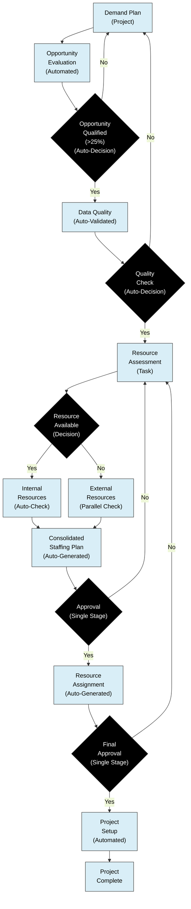

# Optimized Certinia Implementation

This optimized implementation streamlines the workflow by:
- Reducing approval stages
- Automating notifications and updates
- Implementing parallel processes where possible
- Using predefined templates and checklists

## Key Optimizations:
- Automated data quality validation
- Streamlined approval flows
- Parallel processing of internal and external resource checks
- Predefined resource pools for faster staffing
- Direct integration with talent management systems

## Understanding the Optimized Process

The optimized Certinia workflow simplifies resource management through automation and streamlined approvals. Here's how it works in practice:

1. **From Demand to Opportunity**
   - Everything starts with the Demand Plan in Certinia, which kicks off automated opportunity evaluation.
   - The system evaluates each opportunity against your predefined criteria (those with >25% probability move forward).
   - Opportunities that don't meet the threshold return to planning for refinement.

2. **Smart Quality Checks**
   - Qualified opportunities automatically go through Certinia's quality validation.
   - The system ensures all necessary information is complete and accurate.
   - If something's missing, the opportunity returns to planning with clear notifications about what needs fixing.

3. **Finding the Right Resources**
   - Once quality is confirmed, resource assessment begins.
   - Certinia intelligently branches the search in two directions simultaneously:
     * Internal talent matching: Automatically scans your available internal resources
     * External resource evaluation: Checks suitable external options at the same time

4. **Simplified Staffing Decisions**
   - Both resource searches feed into a comprehensive staffing plan that Certinia generates automatically.
   - A single approval step replaces the previous multi-stage approval chain, cutting bureaucracy.
   - If the plan needs adjustments, it simply returns to the resource assessment phase.

5. **Getting to Work**
   - After approval, Certinia automatically handles resource assignment.
   - A final, streamlined approval confirms everything is ready.
   - The system then automatically configures the project.
   - Your team can start working immediately once the project is complete.

This approach transforms your workflow by reducing steps from over 20 to just 14. The improvements focus on:
- Replacing manual reviews with smart validation
- Simplifying multiple approvals into clear decision points
- Searching for internal and external resources simultaneously
- Automating project setup and resource assignment

The result? Significantly faster project initiation while maintaining proper governance and quality control.

