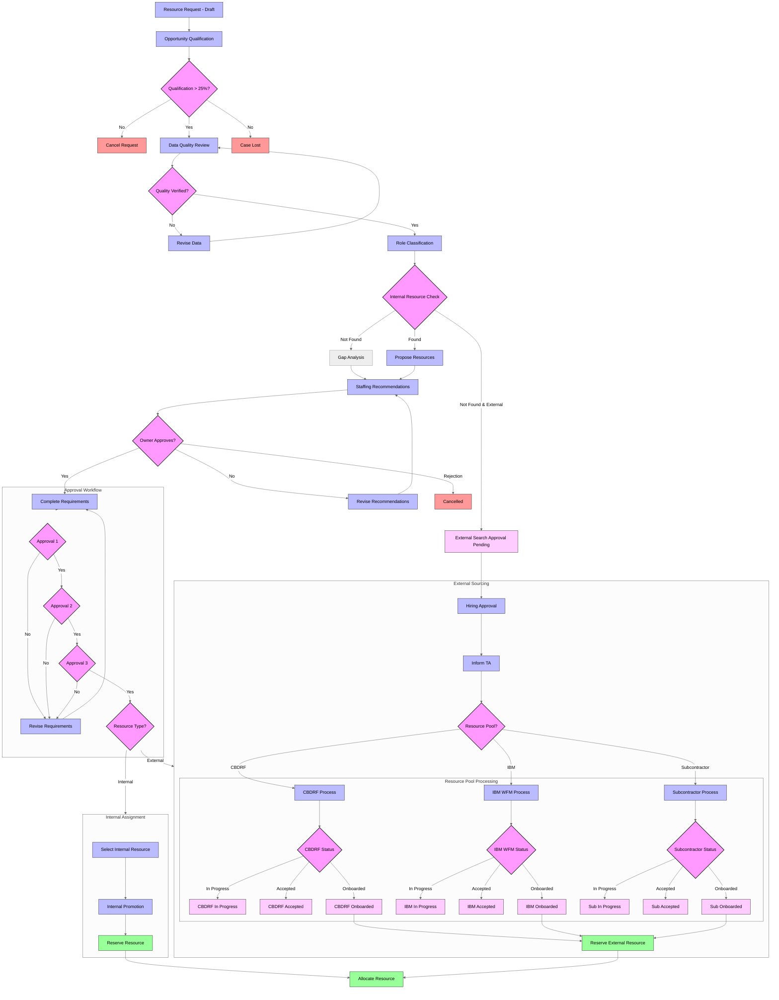
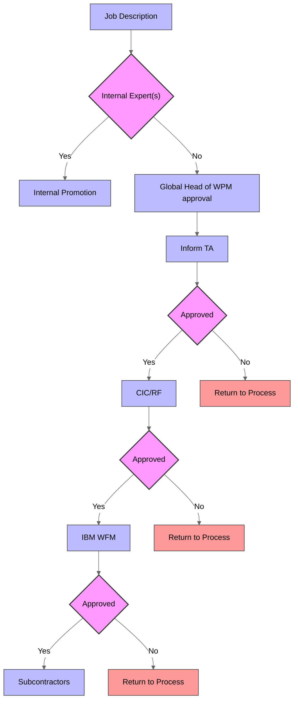

# Workflow Process Analysis: Transform to Certinia

## Overview
This document analyzes the current workflow process depicted in the swimlane flowchart. The chart shows a resource/demand management process that starts with a Demand Plan and flows through various approval stages and checks across different organizational roles.

## Chart Header Information
- **Blue**: Decision/Approval processes
- **Green**: Ticket status indicators
- **Orange**: Interim tool
- **Pink/Purple**: Desired/target tool (Certinia)

## Swimlanes and Participants
The flowchart is organized into vertical swimlanes representing different roles:
- LT (Leadership Team)
- WPM (Work/Project Management)
- Demand Owner
- CBDRF
- IBM WFM
- Subcontractors
- TA (Talent Acquisition)

## Status Indicators (from header)
- **Forecasted**: Initial ticket status
- **New**: Early stage in the process
- **Internal Check**: Verification stage
- **Proposal**: When offering to Demand Owner
- **CBDRF/IBM WFM/Subcontractors**: All have three possible statuses:
  - In progress
  - Accepted
  - Onboarded
- **External Search Approval Pending**: Waiting for approval
- **External Search**: Active external search
- **Softbooked**: Resource tentatively assigned
- **Assigned**: Resource fully assigned
- **Cancelled**: Process terminated
- **Case Lost**: Opportunity not pursued

## Process Flow

### Cross-Swimlane Workflow
1. Process begins with **Demand Plan** in the Demand Owner swimlane
2. Moves to **Opportunity Evaluation** in the WPM swimlane for initial assessment
3. Decision point in WPM: **Opportunity Qualified (>20%)**
   - If Yes: Proceeds to **Mandatory descriptive data quality check** in WPM
   - If No: Process returns or terminates
4. **Quality Check** decision point in WPM swimlane
5. Moves back to Demand Owner swimlane for **RR Update** (Resource Request Update)
6. Continues to **RR Role Classification Update** in Demand Owner swimlane
7. Moves to **Internal Check** in WPM swimlane
8. Decision point in WPM: **Expert(s) Found**
   - If Yes: Moves to **Expert(s) Proposed** in Demand Owner
   - If No: Proceeds to **Gap Analysis** in WPM
9. After **Gap Analysis** or from **Expert(s) Proposed**, moves to **Staffing Recommendations** in WPM
10. Decision point in Demand Owner: **Staffing Recommendation**
    - If Yes: Proceeds to **Job Description**
    - If No: Returns to earlier stages
11. Multiple **Approval** stages across different stakeholders following the Job Description
12. If approvals are successful, process branches to handle different resource types (internal vs. external)
13. For external resources: **NC hiring approval flow** in WPM swimlane
14. **Inform TA** in TA swimlane when applicable
15. **Expert(s) Softbooked** near the end of the process
16. **Assignment** as the final stage of the process

### Resource Pool Integration
The CBDRF, IBM WFM, and Subcontractors swimlanes show specialized processes that integrate with the main workflow when these resource pools are involved in staffing decisions.

## Current System State
- **Interim Tool**: Shown in orange at the top
- **Desired Tool**: Certinia (shown in pink/purple)
- **NC WFM Strategy** appears at the bottom of the chart in the LT swimlane

## Key Decision Points
Multiple approval steps are required throughout the process, with checks at various stages to ensure proper qualification, resource matching, and stakeholder agreement. The workflow frequently crosses between swimlanes, indicating collaboration between different organizational roles throughout the process.

## Certinia Implementation Plan

### 1. Core Object Mapping
| Current Process Component | Certinia Object |
|--------------------------|-----------------|
| Demand Plan | Certinia Resource Request |
| Opportunity Evaluation | Certinia Opportunity |
| Resource/Expert | Certinia Resource |
| Job Description | Resource Request Requirements |
| Assignment | Resource Allocation |

### 2. Status Workflow Conversion
| Current Status | Certinia Status |
|---------------|----------------|
| Forecasted | Draft |
| New | Submitted |
| Internal Check | Under Review |
| Proposal | Proposed |
| In Progress | In Progress |
| Accepted | Accepted |
| Onboarded | Assigned |
| Softbooked | Reserved |
| Assigned | Allocated |
| Cancelled | Cancelled |
| Case Lost | Closed - Lost |

### 3. Implementation Steps

#### Phase 1: Initial Setup
1. Configure Certinia Resource Management module
2. Create custom fields for opportunity qualification percentage
3. Configure approval workflows to match current decision points
4. Set up role-based permissions to mirror current swimlanes

#### Phase 2: Process Flow Implementation
1. Configure Certinia Resource Request process with custom fields
   - Add quality check fields
   - Add role classification fields
2. Implement approval automation for multiple approval stages
3. Create custom dashboards for each role/swimlane
4. Set up notifications to replace manual "Inform TA" step

#### Phase 3: Integration Development
1. Build API integration with external resource pools:
   - CBDRF system integration
   - IBM WFM system integration
   - Subcontractor management system
2. Create automated status synchronization between systems
3. Implement Salesforce Flow for hiring approval process

#### Phase 4: Testing and Validation
1. Create test scenarios for each path in the workflow
2. Validate approval chains work as expected
3. Test cross-system integrations
4. Simulate complete process cycles

#### Phase 5: Deployment and Training
1. Conduct role-based training sessions
2. Implement phased rollout by department
3. Establish feedback mechanism for process improvements
4. Develop documentation for ongoing system maintenance

### 4. External Tools and Integrations
- **Salesforce Flow**: For complex approval routings and conditional logic
- **MuleSoft**: For integration with IBM WFM and other external systems
- **Tableau**: For advanced reporting and analytics on resource utilization
- **Slack Integration**: For notifications and approvals

### 5. Benefits of Certinia Implementation
- Centralized resource management
- Automated approval workflows
- Real-time visibility into resource availability
- Improved forecasting accuracy
- Streamlined communication between departments
- Reduced manual handoffs between swimlanes

## Certinia Workflow Visualization

### Key Improvements in the Updated Flow:
1. **Complete Cross-Swimlane Transitions**: Properly connected flows between all swimlanes
2. **Resource Pool Integration**: Detailed representation of CBDRF, IBM WFM, and Subcontractor processes
3. **TA Swimlane Integration**: Explicit "Inform TA" step in the external resourcing process
4. **Status Tracking**: All status transitions properly represented throughout the flow
5. **Case Closing Paths**: Added proper paths for rejected/cancelled/lost cases
6. **Internal Promotion**: Added the internal promotion step from the TA swimlane 

### Original Flowchart Section (Job Description to Internal Promotion)

This section shows the exact flow from the original diagram where:
1. Process starts at Job Description
2. Branches based on Internal Expert(s) availability
3. If internal experts exist, moves to Internal Promotion
4. If no internal experts, goes through Global Head of WPM approval
5. After TA is informed, follows sequential approval chain:
   - First approval
   - CIC/RF process and approval
   - IBM WFM process and approval
   - Subcontractors process and approval
6. Each approval step has a "No" path that returns to the process 