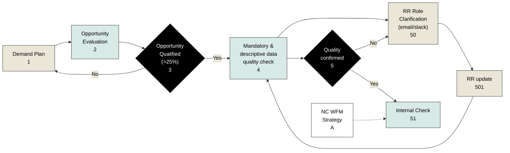
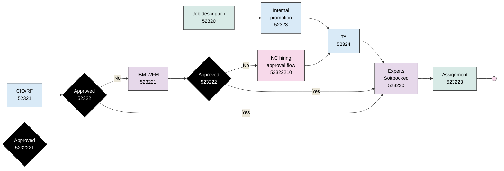

# Flowchart Graph Analysis

## Swimlanes (Top to Bottom)
1. TA - Light Blue (#d9eaf7)
2. Subcontractors - Light Purple (#e6d8ea)
3. IBM WFM - Light Purple (#e6d8ea)
4. CIO/RF - Light Blue (#d9eaf7)
5. Decision/Approval - Light Pink (#f7d9ea)
6. WFM - Light Green (#d8eae6)
7. Demand Lead - Light Yellow (#eae6d8)
8. LT - Light Gray (#e6e6e6)

## JSON Example Format

```json
{
  "nodeId": "5",
  "text": "Quality confirmed",
  "swimlane": "WFM",
  "type": "decision",
  "inputBranches": [{"from": "4", "color": "black", "text": ""}],
  "outputBranches": [
    {"to": "51", "color": "green", "text": "Yes"},
    {"to": "50", "color": "red", "text": "No"}
  ]
}
```

## Flow Patterns

### Main Flow Patterns
1. Initial Loop:
```
2 (Opportunity Evaluation) → 
3 (Opportunity Qualified) -Yes→ 
4 (Mandatory & descriptive data quality check) →
5 (Quality confirmed) -No→ 
50 (RR Role Clarification) →
4 (back to Mandatory check)
```

2. Demand Path:
```
1 (Demand Plan) → 
501 (RR update) → 
50 (RR Role Clarification) →
4 (Mandatory & descriptive data quality check)
```

3. Expert Finding Path:
```
5 (Quality confirmed) -Yes→
51 (Internal Check) →
52 (Expert(s) Found) -Yes→
520 (Expert(s) Proposed) →
522 (Staffing Recommendations)
```

4. Gap Analysis Path:
```
52 (Expert(s) Found) -No→
521 (Gap Analysis) →
522 (Staffing Recommendations)
```

5. Approval Chain:
```
522 (Staffing Recommendations) →
523 (Staffing Recommendation Acceptance) -Yes→
5230 (Job description) →
5232 (Global Head WFM approval) -Yes→
Multiple Parallel Approvals (52321, 523220, 523221) →
52322 (Approved) -Yes→
523223 (Assignment)
```

6. Return Loops:
```
5232 (Global Head WFM approval) -No→
5231 (Inform TA) →
5230 (back to Job description)
```

## Node Details

### States and Transitions (YAML format)

```yaml
Node ID: 1
Text: Demand Plan
Swimlane: Demand Lead
Type: start
Input Branches: []
Output Branches: [(501, "")]
```

```yaml
Node ID: 2
Text: Opportunity Evaluation
Swimlane: WFM
Type: start
Input Branches: []
Output Branches: [(3, "")]
```

```yaml
Node ID: 3
Text: Opportunity Qualified (>25%)
Swimlane: WFM
Type: decision
Input Branches: [(2, "")]
Output Branches: [(4, "Yes"), (null, "No")]
```

```yaml
Node ID: 4
Text: Mandatory & descriptive data quality check
Swimlane: WFM
Type: state
Input Branches: [(3, "Yes"), (50, "")]
Output Branches: [(5, "")]
```

```yaml
Node ID: 5
Text: Quality confirmed
Swimlane: WFM
Type: decision
Input Branches: [(4, "")]
Output Branches: [(51, "Yes"), (50, "No")]
```

```yaml
Node ID: 50
Text: RR Role Clarification (email/slack)
Swimlane: Demand Lead
Type: state
Input Branches: [(501, ""), (5, "No")]
Output Branches: [(4, "")]
```

```yaml
Node ID: 501
Text: RR update
Swimlane: Demand Lead
Type: state
Input Branches: [(1, "")]
Output Branches: [(50, "")]
```

```yaml
Node ID: 51
Text: Internal Check
Swimlane: WFM
Type: state
Input Branches: [(5, "Yes")]
Output Branches: [(52, "")]
```

```yaml
Node ID: 52
Text: Expert(s) Found
Swimlane: WFM
Type: decision
Input Branches: [(51, "")]
Output Branches: [(520, "Yes"), (521, "No")]
```

```yaml
Node ID: 520
Text: Expert(s) Proposed
Swimlane: WFM
Type: state
Input Branches: [(52, "Yes")]
Output Branches: [(522, "")]
```

```yaml
Node ID: 521
Text: Gap Analysis
Swimlane: WFM
Type: state
Input Branches: [(52, "No")]
Output Branches: [(522, "")]
```

```yaml
Node ID: 522
Text: Staffing Recommendations
Swimlane: WFM
Type: state
Input Branches: [(520, ""), (521, "")]
Output Branches: [(523, "")]
```

```yaml
Node ID: 523
Text: Staffing Recommendation Acceptance
Swimlane: Decision/Approval
Type: decision
Input Branches: [(522, "")]
Output Branches: [(5230, "Yes"), (522, "No")]
```

```yaml
Node ID: 5230
Text: Job description
Swimlane: WFM
Type: decision
Input Branches: [(523, "Yes"), (5231, "")]
Output Branches: [(5232, "")]
```

```yaml
Node ID: 5231
Text: Inform TA
Swimlane: WFM
Type: state
Input Branches: [(5232, "No")]
Output Branches: [(5230, "")]
```

```yaml
Node ID: 5232
Text: Global Head of WFM approval
Swimlane: Decision/Approval
Type: decision
Input Branches: [(5230, "")]
Output Branches: [(52321, "Yes"), (5231, "No")]
```

```yaml
Node ID: 52321
Text: CIO/RF
Swimlane: CIO/RF
Type: state
Input Branches: [(5232, "Yes")]
Output Branches: [(52322, "")]
```

```yaml
Node ID: 523220
Text: Subcontractors
Swimlane: Subcontractors
Type: state
Input Branches: [(5232, "Yes")]
Output Branches: [(52322, "")]
```

```yaml
Node ID: 523221
Text: IBM WFM
Swimlane: IBM WFM
Type: state
Input Branches: [(5232, "Yes")]
Output Branches: [(52322, "")]
```

```yaml
Node ID: 52322
Text: Approved
Swimlane: Decision/Approval
Type: decision
Input Branches: [(52321, ""), (523220, ""), (523221, "")]
Output Branches: [(523223, "Yes"), (null, "No")]
```

```yaml
Node ID: 523223
Text: Assignment
Swimlane: WFM
Type: end_state
Input Branches: [(52322, "Yes")]
Output Branches: []
```

```yaml
Node ID: 52323
Text: Internal promotion
Swimlane: TA
Type: state
Input Branches: [(52322, "Yes")]
Output Branches: [(52324, "")]
```

```yaml
Node ID: 52324
Text: TA
Swimlane: TA
Type: end_state
Input Branches: [(52323, "")]
Output Branches: []
```

```yaml
Node ID: 5232210
Text: NC hiring approval flow
Swimlane: Decision/Approval
Type: state
Input Branches: [(52322, "Yes")]
Output Branches: [(523220, "")]
```

## Mermaid Flowchart

```mermaid
%%{init: {
  'theme': 'base',
  'themeVariables': { 
    'background': 'transparent',
    'primaryColor': '#d8eae6',
    'primaryTextColor': 'black',
    'primaryBorderColor': '#333',
    'lineColor': '#333'
  }
}}%%

flowchart TB
    %% Style Definitions
    classDef defaultStyle fill:white,stroke:#333,stroke-width:1px;
    classDef startStyle fill:#d8eae6,stroke:#333,stroke-width:1px,color:black;
    classDef endStyle fill:#f7d9ea,stroke:#333,stroke-width:1px,color:black;
    classDef stateStyle fill:#d8eae6,stroke:#333,stroke-width:1px,color:black;
    classDef decisionStyle fill:black,stroke:#333,stroke-width:1px,color:white;
    classDef demandLeadStyle fill:#eae6d8,stroke:#333,stroke-width:1px,color:black;
    classDef wfmStyle fill:#d8eae6,stroke:#333,stroke-width:1px,color:black;
    classDef approvalStyle fill:#f7d9ea,stroke:#333,stroke-width:1px,color:black;
    classDef cioStyle fill:#d9eaf7,stroke:#333,stroke-width:1px,color:black;
    classDef ibmStyle fill:#e6d8ea,stroke:#333,stroke-width:1px,color:black;
    classDef subStyle fill:#e6d8ea,stroke:#333,stroke-width:1px,color:black;
    classDef taStyle fill:#d9eaf7,stroke:#333,stroke-width:1px,color:black;

    %% Initial Process Nodes
    n1["Demand Plan<br/>1"]
    n2["Opportunity<br/>Evaluation<br/>2"]
    n3{"Opportunity<br/>Qualified<br/>(>25%)<br/>3"}
    n4["Mandatory &<br/>descriptive data<br/>quality check<br/>4"]
    n5{"Quality<br/>confirmed<br/>5"}
    n50["RR Role<br/>Clarification<br/>(email/slack)<br/>50"]
    n501["RR update<br/>501"]
    n51["Internal Check<br/>51"]
    nA["NC WFM<br/>Strategy<br/>A"]
    nB["Opportunity<br/>Closing Stage<br/>B"]

    %% Expert Finding Nodes
    n52{"Expert(s)<br/>Found<br/>52"}
    n520["Expert(s)<br/>Proposed<br/>520"]
    n521["Gap Analysis<br/>521"]
    n522["Staffing<br/>Recommendations<br/>522"]
    n523{"Staffing<br/>Recommendation<br/>Acceptance<br/>523"}
    n5230{"Internal<br/>Expert(s)<br/>5230"}
    n5231["Inform TA<br/>5231"]
    n5232{"Global Head of<br/>WFM approval<br/>5232"}
    n52320["Job description<br/>52320"]
    n52321["CIO/RF<br/>52321"]
    n52322{"Approved<br/>52322"}

    %% Final Process Nodes
    n52323["Internal<br/>promotion<br/>52323"]
    n52324["TA<br/>52324"]
    n523220["Experts<br/>Softbooked<br/>523220"]
    n523221["IBM WFM<br/>523221"]
    n523222{"Approved<br/>523222"}
    n523223["Assignment<br/>523223"]
    n52322210["NC hiring<br/>approval flow<br/>52322210"]
    n5232221{"Approved<br/>5232221"}
    stop(( ))

    %% Initial Flow Connections
    n1 --> n2
    n2 --> n3
    n3 -->|No| n1
    n3 -->|Yes| n4
    n4 --> n50
    n50 --> n501
    n501 --> n4
    n4 --> n5
    n5 -->|Yes| n51
    n5 -->|No| n50
    nA -.-> n51

    %% Expert Finding Flow
    n51 --> n52
    n52 -->|Yes| n520
    n52 -->|No| n521
    n520 --> n522
    n521 --> n522
    n522 --> n523
    n523 -->|No| n51

    %% Approval Chain
    n523 -->|Yes| n5230
    n5230 -->|No| n5231
    n5231 --> n5232
    n5232 -->|Yes| n5230
    n5230 -->|Yes| n52320
    n52320 --> n52321
    n52321 --> n52322

    %% Final Paths
    n52320 --> n52323
    n52323 --> n52324
    n52324 --> n523220
    n523220 --> n523223
    n523223 --> stop
    n52322 -->|Yes| n523220
    n52322 -->|No| n523221
    n523221 --> n523222
    n523222 -->|Yes| n523220
    n523222 -->|No| n52322210
    n52322210 --> n52324
    n5232221 -->|Yes| n523220
    n5232221 -->|No| n52322210
    nB -.-> n523223

    %% Apply Styles
    class n1,n50,n501 demandLeadStyle;
    class n2,n4,n51,n520,n521,n522,n5231,n52320,n523223 wfmStyle;
    class n52321 cioStyle;
    class n52323,n52324 taStyle;
    class n523220 subStyle;
    class n523221 ibmStyle;
    class n3,n5,n52,n523,n5230,n5232,n52322,n523222,n5232221 decisionStyle;
    class n52322210 approvalStyle;
    class stop endStyle;
    class nA,nB defaultStyle;

    %% Layout Hints
    %% These invisible edges help with layout
    n1 ~~~ n2 ~~~ n3
    n50 ~~~ n501 ~~~ n4
    n520 ~~~ n521 ~~~ n522
    n52323 ~~~ n52324 ~~~ n523220
    n523221 ~~~ n523222 ~~~ n523223
```



## Branch Color Coding
- Black: Normal flow transitions
- Green + "Yes": Positive decision outcomes
- Red + "No": Negative decision outcomes/returns to previous states

## Swimlane Color Legend
- Demand Lead: Light Yellow (#eae6d8)
- WFM: Light Green (#d8eae6)
- Decision/Approval: Light Pink (#f7d9ea)
- CIO/RF: Light Blue (#d9eaf7)
- IBM WFM: Light Purple (#e6d8ea)
- Subcontractors: Light Purple (#e6d8ea)
- TA: Light Blue (#d9eaf7)
- LT: Light Gray (#e6e6e6)

## Section 1 Graph (Mermaid)



Notes about this section:
1. Enforced numerical order: 1 -> 2 -> 3 -No-> 1
2. Secondary path: 3 -Yes-> 4 -> 50 -> 501 -> 4
3. Direction maintained as LR (Left to Right)
4. Node IDs prefixed with 'n' to avoid mermaid syntax issues
5. All original styling and formatting preserved
6. Dotted line for NC WFM Strategy connection
7. Yes/No labels on decision paths
8. Original node numbers included in labels 

## Section 2 Graph (Mermaid)

```mermaid
%%{init: {
  'theme': 'base',
  'themeVariables': { 
    'background': 'transparent',
    'primaryColor': '#d8eae6',
    'primaryTextColor': 'black',
    'primaryBorderColor': '#333',
    'lineColor': '#333'
  }
}}%%

flowchart LR
    %% Style Definitions
    classDef defaultStyle fill:white,stroke:#333,stroke-width:1px;
    classDef startStyle fill:#d8eae6,stroke:#333,stroke-width:1px,color:black;
    classDef stateStyle fill:#d8eae6,stroke:#333,stroke-width:1px,color:black;
    classDef decisionStyle fill:black,stroke:#333,stroke-width:1px,color:white;
    classDef wfmStyle fill:#d8eae6,stroke:#333,stroke-width:1px,color:black;
    classDef approvalStyle fill:#f7d9ea,stroke:#333,stroke-width:1px,color:black;
    classDef cioStyle fill:#d9eaf7,stroke:#333,stroke-width:1px,color:black;

    %% Nodes in numerical order
    n5{"Quality<br/>confirmed<br/>5"}
    n51["Internal Check<br/>51"]
    n52{"Expert(s)<br/>Found<br/>52"}
    n520["Expert(s)<br/>Proposed<br/>520"]
    n521["Gap Analysis<br/>521"]
    n522["Staffing<br/>Recommendations<br/>522"]
    n523{"Staffing<br/>Recommendation<br/>Acceptance<br/>523"}
    n5230["Internal<br/>Expert(s)<br/>5230"]
    n5231["Inform TA<br/>5231"]
    n5232{"Global Head of<br/>WFM approval<br/>5232"}
    n52320["Job description<br/>52320"]
    n52321["CIO/RF<br/>52321"]
    n52322{"Approved<br/>52322"}

    %% First specified path
    n5 -->|Yes| n51
    n51 --> n52
    n52 -->|Yes| n520
    n520 --> n522
    n522 --> n523
    n523 -->|No| n51

    %% Second specified path
    n52 -->|No| n521
    n521 --> n522

    %% Third specified path
    n523 -->|Yes| n5230
    n5230 -->|No| n5231
    n5231 --> n5232
    n5232 -->|Yes| n5230
    n5230 --> n52320
    n52320 --> n52321
    n52321 --> n52322

    %% Apply Styles
    class n51,n520,n521,n522,n5231 wfmStyle;
    class n52320,n52321 cioStyle;
    class n5,n52,n523,n5232,n52322 decisionStyle;
    class n5230 approvalStyle;
```



Notes about this section:
1. Enforced paths in exact numerical order:
   - 5 -Yes-> 51 -> 52 -Yes-> 520 -> 522 -> 523 -No-> 51
   - 52 -No-> 521 -> 522
   - 523 -Yes-> 5230 -No-> 5231 -> 5232 -Yes-> 5230 -> 52320 -> 52321 -> 52322
2. Direction maintained as LR (Left to Right)
3. Node IDs prefixed with 'n' to avoid mermaid syntax issues
4. All original styling and formatting preserved
5. Yes/No labels on decision paths
6. Original node numbers included in labels
7. 523222 omitted as requested 

## Section 3 Graph (Mermaid)



Notes about Section 3:
1. Enforced paths in exact numerical order:
   - 52320 -> 52323 -> 52324 -> 523220 -> 523223 -> stop
   - 52321 -> 52322 -Yes-> 523220
   - 52322 -No-> 523221 -> 523222 -Yes-> 523220
   - 5232221 -No-> 52322210 -> 52324
   - 5232221 -Yes-> 523220
2. Added connection from TA (52324) to Experts Softbooked (523220)
3. Color coding preserved:
   - Light Blue (#d9eaf7) for TA and CIO/RF nodes
   - Light Purple (#e6d8ea) for Subcontractors/IBM WFM
   - Light Pink (#f7d9ea) for Approval nodes
   - Light Green (#d8eae6) for WFM nodes
4. Decision nodes in black with white text
5. Original node numbers included in labels
6. Stop node added as end state